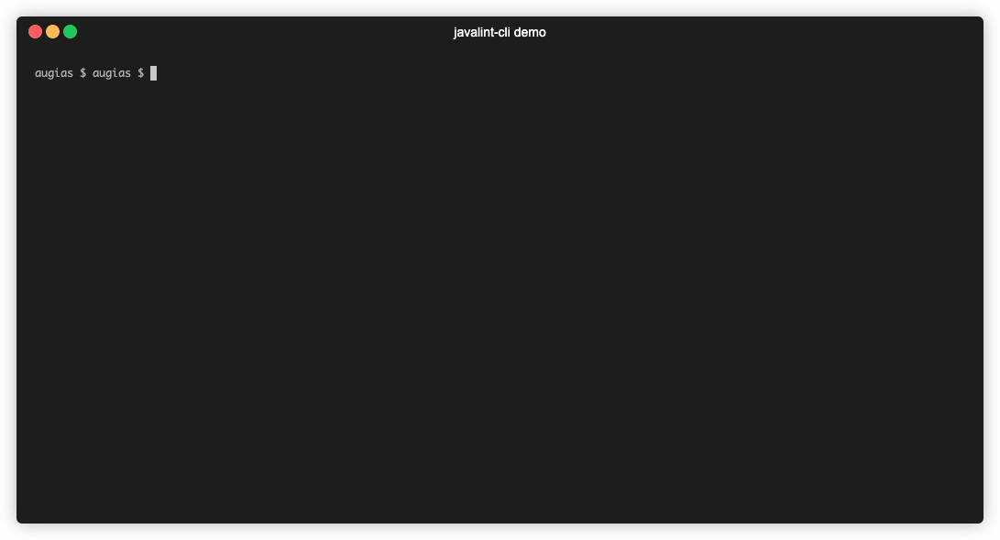

# Javalint

Java, XML, JSON and YAML formatter based on Intellij CE formatter,
inspired by [ktlint](https://github.com/pinterest/ktlint).

Distributed as command-line cli tool and a `Linter` implementation compatible with
[editorconfig-maven-plugin](https://github.com/ec4j/editorconfig-maven-plugin),
[editorconfig-gradle-plugin](https://github.com/ec4j/editorconfig-gradle-plugin).

## Key features

* `.editorconfig` support
* Compatibility with all settings present in Intellij CE
* Maven and Gradle integration with `editorconfig-maven-plugin`, `editorconfig-gradle-plugin`
* Executable jar
* No configuration required

## Demo

CLI demo which fixes formatting in one file, changing indents and code wrapping.

<p>

</p>


## CLI usage

CLI provides similar API as `Ktlint` CLI.

Basic usage:

```bash
$ javalint               # checks formatting for all the files in this directory
$ javalint src/**/*.java  # checks all *.java files in src directory
$ javalint -F            # fixes formatting for all the files in this directory
$ javalint --help        # print detailed usage information
```

## Maven integration

### Code sample

Following configuration will check all files formatting
(except `target`, `build`, `node_modules` folders).

```xml

<project>
  <!-- Add plugin repository -->
  <pluginRepositories>
    <pluginRepository>
      <id>javalint-releases</id>
      <url>https://s3.eu-north-1.amazonaws.com/kamil.perczynski-maven/release</url>
    </pluginRepository>
  </pluginRepositories>

  <!-- Add ec4j maven plugin -->
  <plugins>
    <plugin>
      <groupId>org.ec4j.maven</groupId>
      <artifactId>editorconfig-maven-plugin</artifactId>
      <version>0.1.3</version>

      <!-- Add javalint-ec4j-linter -->
      <dependencies>
        <dependency>
          <groupId>io.github.kamilperczynski.javalint</groupId>
          <artifactId>javalint-ec4j-linter</artifactId>
          <version>1.1</version>
        </dependency>
      </dependencies>

      <executions>
        <execution>
          <id>check</id>
          <phase>validate</phase>
          <goals>
            <goal>check</goal>
          </goals>
        </execution>
      </executions>

      <!-- Disable default linters from ec4j -->
      <configuration>
        <linters>
          <linter>
            <id>org.ec4j.linters.TextLinter</id>
            <enabled>false</enabled>
          </linter>
          <linter>
            <id>org.ec4j.linters.XmlLinter</id>
            <enabled>false</enabled>
          </linter>
        </linters>
      </configuration>
    </plugin>
  </plugins>
</project>
```

## Gradle integration

`...`

## Legal Notices

This software includes code from IntelliJ IDEA CE
Copyright (C) JetBrains s.r.o.
https://www.jetbrains.com/idea/

---

This project is not affiliated with JetBrains.

